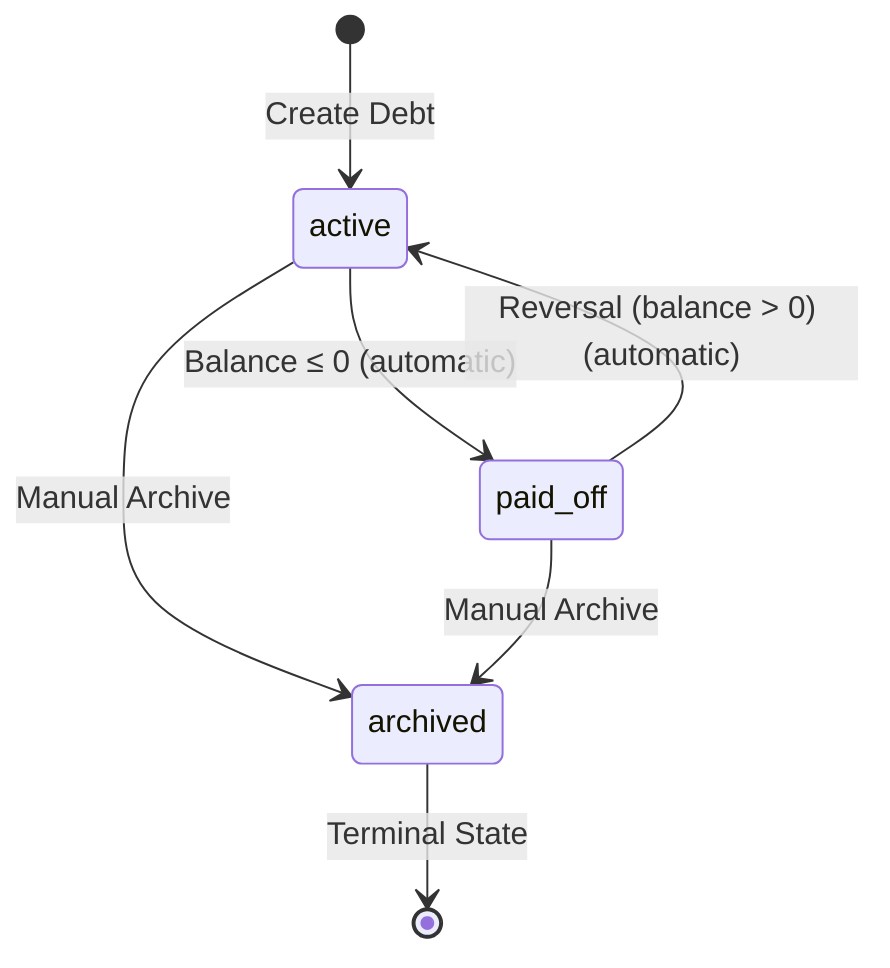

# Debt Feature - Validation Rules and State Machine

## Overview

This document defines comprehensive validation rules, state transitions, and business logic for the debt tracking feature. All validations ensure data integrity in an offline-first, multi-device environment.

## State Machine

### Debt Status Transitions



### Status Rules

1. **active**: Default status for new debts
   - Can receive payments
   - Appears in transaction dropdowns
   - Shows in main debt list

2. **paid_off**: Automatically set when balance reaches zero or below (including overpayments)
   - Cannot receive new payments (unless reactivated via reversal)
   - Hidden from transaction dropdowns
   - Shows in debt list with "Paid Off" badge
   - Negative balance shown as "Overpaid by ₱X" in UI

3. **archived**: Manually set for special cases
   - Terminal state (cannot be reactivated in MVP)
   - Hidden from main views (accessible via filter)
   - Use cases: forgiven, sold, disputed, tracking error

### Transition Implementation

```typescript
// Automatic transition to paid_off
async function updateDebtStatusFromBalance(
  debtId: string,
  type: "external" | "internal"
): Promise<void> {
  const balance = await calculateDebtBalance(debtId, type);
  const table = type === "external" ? db.debts : db.internalDebts;
  const debt = await table.get(debtId);

  if (!debt) return;

  // Auto transition: active → paid_off
  if (balance <= 0 && debt.status !== "paid_off" && debt.status !== "archived") {
    // Balance is zero or negative (overpaid) - mark as paid off
    // Set closed_at to current timestamp for archival boundary checking
    // Do not auto-update archived debts
    await table.update(debtId, {
      status: "paid_off",
      closed_at: new Date(), // TIMESTAMPTZ - marks when debt was closed
    });
  }

  // Auto transition: paid_off → active (reversal occurred)
  else if (balance > 0 && debt.status === "paid_off") {
    await table.update(debtId, {
      status: "active",
      closed_at: null, // Clear closed_at when debt becomes active again
    });
  }

  // Note: archived is terminal - no automatic transitions
}
```

## Database-Level Validations

### 1. Amount Validations

```sql
-- Debts table
CHECK (original_amount_cents > 0)  -- Must be positive

-- Debt payments table
CHECK (amount_cents != 0)  -- No zero payments allowed
-- Note: Negative amounts allowed for reversals
```

### 2. Entity Type Validations

```sql
-- Internal debts
CHECK (from_type IN ('category', 'account', 'member'))
CHECK (to_type IN ('category', 'account', 'member'))

-- Events table
CHECK (entity_type IN (
  'transaction', 'account', 'category', 'budget',
  'debt', 'internal_debt', 'debt_payment'
))
```

### 3. Debt Payment Constraints

```sql
-- Only one debt type per payment
CONSTRAINT one_debt_type CHECK (
  (debt_id IS NOT NULL AND internal_debt_id IS NULL) OR
  (debt_id IS NULL AND internal_debt_id IS NOT NULL)
)

-- Transaction must exist (NO CASCADE - reversal handles deletion)
transaction_id UUID NOT NULL REFERENCES transactions(id)
```

### 4. Self-Borrowing Prevention

```sql
-- Trigger to prevent self-borrowing in internal debts
CREATE OR REPLACE FUNCTION check_internal_debt_entities()
RETURNS TRIGGER AS $$
BEGIN
  IF NEW.from_type = NEW.to_type AND NEW.from_id = NEW.to_id THEN
    RAISE EXCEPTION 'Cannot create internal debt with same source and destination';
  END IF;
  RETURN NEW;
END;
$$ LANGUAGE plpgsql;

CREATE TRIGGER prevent_self_borrowing
BEFORE INSERT OR UPDATE ON internal_debts
FOR EACH ROW EXECUTE FUNCTION check_internal_debt_entities();
```

## Application-Level Validations

### 1. Debt Creation

```typescript
interface DebtCreationRules {
  // Name validation
  nameMinLength: 1;
  nameMaxLength: 100;
  nameUnique: true; // Per household, for active debts only

  // Amount validation
  minAmount: 100; // ₱1.00 minimum
  maxAmount: 999999999; // ₱9,999,999.99 system max

  // Internal debt specific
  requireDifferentEntities: true; // from !== to
}

function validateDebtCreation(data: DebtFormData): ValidationResult {
  const errors: string[] = [];

  // Name validation
  if (!data.name?.trim()) {
    errors.push("Name is required");
  } else if (data.name.length > 100) {
    errors.push("Name must be 100 characters or less");
  }

  // Name uniqueness validation (per household, for active debts only)
  if (data.name?.trim()) {
    const duplicateDebt = await db.debts
      .where("household_id")
      .equals(data.household_id)
      .and(
        (debt) =>
          debt.name.toLowerCase() === data.name.toLowerCase() &&
          debt.status === "active" &&
          debt.id !== data.id // Exclude self when editing
      )
      .first();

    if (duplicateDebt) {
      errors.push(`An active debt named "${data.name}" already exists`);
    }
  }

  // Amount validation
  if (data.original_amount_cents < 100) {
    errors.push("Amount must be at least ₱1.00");
  }
  if (data.original_amount_cents > 999999999) {
    errors.push("Amount exceeds maximum of ₱9,999,999.99");
  }

  // Internal debt validation
  if (data.type === "internal") {
    if (data.from_type === data.to_type && data.from_id === data.to_id) {
      errors.push("Cannot borrow from the same entity");
    }

    // Validate entity existence (runtime check, no FK constraints)
    if (!(await validateEntityExists(data.from_type, data.from_id))) {
      errors.push(`Invalid ${data.from_type} selected`);
    }
    if (!(await validateEntityExists(data.to_type, data.to_id))) {
      errors.push(`Invalid ${data.to_type} selected`);
    }

    // Validate entity types
    const validTypes = ["category", "account", "member"];
    if (!validTypes.includes(data.from_type)) {
      errors.push(`Invalid from_type: ${data.from_type}`);
    }
    if (!validTypes.includes(data.to_type)) {
      errors.push(`Invalid to_type: ${data.to_type}`);
    }
  }

  return { valid: errors.length === 0, errors };
}

// Runtime entity existence validation (no FK constraints in database)
// Internal debt references are soft (no CASCADE) for flexibility
// This allows entities to be deleted/renamed without breaking debt history
// Database does not enforce entity existence - validation happens here in application layer
// See debt-implementation.md:1174-1177 for rationale
async function validateEntityExists(
  entityType: "category" | "account" | "member",
  entityId: string
): Promise<boolean> {
  switch (entityType) {
    case "category":
      const category = await db.budgetCategories.get(entityId);
      return !!category && !category.deleted_at;

    case "account":
      const account = await db.accounts.get(entityId);
      return !!account && !account.deleted_at;

    case "member":
      const member = await db.profiles.get(entityId);
      return !!member;

    default:
      return false;
  }
}
```

### 2. Payment Validation

```typescript
interface PaymentValidationRules {
  // Amount rules
  minPayment: 1; // ₱0.01 minimum
  allowOverpayment: true; // Accept but track

  // Status rules
  allowedDebtStatuses: ["active"]; // UI: Cannot pay archived/paid_off
  // Note: Sync accepts archived debts if payment_date <= closed_at (see validateDebtPaymentDuringSync)

  // Transaction rules
  allowedTransactionTypes: ["expense", "transfer"];
}

function validateDebtPayment(
  transaction: TransactionFormData,
  debt: Debt | InternalDebt,
  debtType: "external" | "internal",
  context: "ui" | "sync" = "ui"
): ValidationResult {
  const warnings: string[] = [];
  const errors: string[] = [];

  // Status validation (context-dependent)
  if (context === "ui") {
    // UI context: Block all non-active debts
    if (debt.status !== "active") {
      errors.push(`Cannot make payment to ${debt.status} debt`);
    }
  } else if (context === "sync") {
    // Sync context: Allow archived debts if payment dated before closure
    if (debt.status === "archived") {
      if (!debt.closed_at) {
        errors.push("Archived debt missing closed_at timestamp");
      } else if (new Date(transaction.date) > new Date(debt.closed_at)) {
        errors.push(
          `Cannot add payment to archived debt dated after closure (${new Date(debt.closed_at).toLocaleDateString()})`
        );
      }
      // If payment_date <= closed_at, allow it to proceed
    } else if (debt.status === "paid_off") {
      // Paid off debts can auto-revert to active, so accept payments
      // The status will be recalculated after payment
    }
  }

  // Amount validation
  if (transaction.amount_cents < 1) {
    errors.push("Payment amount must be positive");
  }

  // Overpayment detection (warning only)
  const currentBalance = await calculateDebtBalance(debt.id, debtType);

  // Flag if balance is already <= 0 OR payment exceeds positive balance
  if (currentBalance <= 0 || transaction.amount_cents > currentBalance) {
    const overpayment =
      currentBalance > 0 ? transaction.amount_cents - currentBalance : transaction.amount_cents;
    warnings.push(`Payment exceeds balance by ${formatPHP(overpayment)}`);
    // Still valid - we accept and track overpayments
  }

  // Transaction type validation - depends on debt type
  if (debtType === "external") {
    // External debts: Only expenses allowed
    if (transaction.type !== "expense") {
      errors.push("External debt payments must be recorded as expenses");
    }
  } else {
    // Internal debts: Both expenses and transfers allowed
    if (!["expense", "transfer"].includes(transaction.type)) {
      errors.push("Internal debt payments must be expenses or transfers");
    }
  }

  return {
    valid: errors.length === 0,
    errors,
    warnings,
  };
}
```

### 3. Deletion Validation

```typescript
async function validateDebtDeletion(
  debtId: string,
  type: "external" | "internal"
): Promise<ValidationResult> {
  const errors: string[] = [];

  // Check for existing payments (handle both debt types)
  const field = type === "external" ? "debt_id" : "internal_debt_id";
  const paymentCount = await db.debtPayments.where(field).equals(debtId).count();

  if (paymentCount > 0) {
    errors.push("Cannot delete debt with payment history. Archive it instead.");
  }

  // Check for pending sync operations
  const pendingOps = await db.syncQueue
    .where("entity_id")
    .equals(debtId)
    .and((item) => item.status === "queued" || item.status === "syncing")
    .count();

  if (pendingOps > 0) {
    errors.push(
      "Cannot delete debt with pending sync operations. Please wait for sync to complete."
    );
  }

  // Check for pending payment sync operations
  const pendingPayments = await db.syncQueue
    .where("entity_type")
    .equals("debt_payment")
    .and((item) => {
      const payload = item.payload as DebtPayment;
      const hasDebtId =
        type === "external" ? payload.debt_id === debtId : payload.internal_debt_id === debtId;
      return hasDebtId && (item.status === "queued" || item.status === "syncing");
    })
    .count();

  if (pendingPayments > 0) {
    errors.push(
      `Cannot delete debt with ${pendingPayments} pending payment(s). Please wait for sync to complete.`
    );
  }

  return { valid: errors.length === 0, errors };
}
```

### 4. Transaction Edit Validation

```typescript
function validateTransactionEdit(
  oldTransaction: Transaction,
  newData: TransactionFormData
): ValidationResult {
  const warnings: string[] = [];

  // Changing debt link
  if (
    oldTransaction.debt_id !== newData.debt_id ||
    oldTransaction.internal_debt_id !== newData.internal_debt_id
  ) {
    warnings.push("Changing debt link will create reversal for old debt");
  }

  // Amount change
  if (oldTransaction.amount_cents !== newData.amount_cents) {
    warnings.push("Amount change will create reversal and new payment");
  }

  return {
    valid: true, // Always valid, just inform user
    warnings,
  };
}
```

## Sync and Conflict Validations

### 1. Idempotency Validation

```typescript
function validateIdempotencyKey(key: string): boolean {
  // Format: deviceId-entityType-entityId-lamportClock
  const pattern = /^[a-zA-Z0-9]+-debt_payment-[a-zA-Z0-9]+-\d+$/;
  return pattern.test(key);
}

// Prevent duplicate payments
async function preventDuplicatePayment(idempotencyKey: string): Promise<boolean> {
  const existing = await db.events.where("idempotency_key").equals(idempotencyKey).first();

  return !existing; // Valid if not exists
}
```

### 2. Concurrent Edit Detection

```typescript
function detectConcurrentEdits(localEvent: Event, remoteEvent: Event): ConflictType {
  // Check vector clocks
  if (localEvent.entity_id !== remoteEvent.entity_id) {
    return "none"; // Different entities
  }

  // Compare vector clocks
  const comparison = compareVectorClocks(localEvent.vector_clock, remoteEvent.vector_clock);

  if (comparison === "concurrent") {
    // Conflict detected - use deterministic resolution
    return "concurrent_edit";
  }

  return "none";
}
```

## Currency Validations

### 1. Amount Range Validation

```typescript
const CURRENCY_LIMITS = {
  MIN_CENTS: 0,
  MAX_CENTS: 999999999, // ₱9,999,999.99

  // Practical limits
  MIN_DEBT: 100, // ₱1.00 minimum debt
  MIN_PAYMENT: 1, // ₱0.01 minimum payment
};

function validateAmount(cents: number, type: "debt" | "payment"): boolean {
  if (!Number.isInteger(cents)) {
    return false; // Must be integer cents
  }

  if (type === "debt") {
    return cents >= CURRENCY_LIMITS.MIN_DEBT && cents <= CURRENCY_LIMITS.MAX_CENTS;
  }

  if (type === "payment") {
    return cents >= CURRENCY_LIMITS.MIN_PAYMENT && cents <= CURRENCY_LIMITS.MAX_CENTS;
  }

  return false;
}
```

### 2. Display Validation

```typescript
function validateCurrencyInput(input: string): ValidationResult {
  const cleaned = input.replace(/[₱,\s]/g, "");
  const parsed = parseFloat(cleaned);

  if (isNaN(parsed)) {
    return { valid: false, error: "Invalid amount format" };
  }

  const cents = Math.round(parsed * 100);

  if (cents > CURRENCY_LIMITS.MAX_CENTS) {
    return {
      valid: false,
      error: `Amount exceeds maximum of ${formatPHP(CURRENCY_LIMITS.MAX_CENTS)}`,
    };
  }

  return { valid: true, value: cents };
}
```

## UI/UX Validations

### 1. Form Validations

```typescript
const FORM_RULES = {
  // Real-time validation
  validateOnBlur: true,
  validateOnChange: false, // Only after first blur

  // Submission
  preventDoubleSubmit: true,
  showWarningsBeforeSubmit: true,

  // Field-specific
  amount: {
    format: /^\d+(\.\d{0,2})?$/, // Max 2 decimal places
    min: 0.01,
    max: 9999999.99,
  },

  name: {
    required: true,
    maxLength: 100,
    trim: true,
  },

  date: {
    max: "today", // No future dates for payments
    min: "1900-01-01", // Reasonable minimum
  },
};
```

### 2. Dropdown Filtering

```typescript
function getSelectableDebts(debts: Debt[]): Debt[] {
  return debts
    .filter((debt) => {
      // Only show active debts
      if (debt.status !== "active") return false;

      // Hide if balance is negative (overpaid)
      const balance = calculateDebtBalance(debt.id, debt.type);
      if (balance < 0) return false;

      return true;
    })
    .sort((a, b) => {
      // Sort by most recently updated
      return new Date(b.updated_at).getTime() - new Date(a.updated_at).getTime();
    });
}
```

### 3. Warning Display Rules

```typescript
interface WarningDisplay {
  overpayment: {
    severity: "warning";
    dismissible: false;
    showAmount: true;
    suggestAction: "review";
  };

  reversal: {
    severity: "info";
    dismissible: true;
    showReason: true;
    suggestAction: null;
  };

  archived: {
    severity: "info";
    dismissible: false;
    showDate: true;
    suggestAction: "filter";
  };
}
```

## Error Recovery

### 1. Invalid State Recovery

```typescript
async function recoverInvalidDebtState(
  debtId: string,
  type: "external" | "internal" = "external"
): Promise<void> {
  const table = type === "external" ? db.debts : db.internalDebts;
  const debt = await table.get(debtId);
  if (!debt) return;

  const balance = await calculateDebtBalance(debtId, type);

  // Fix status inconsistency - balance at or below zero should be paid_off
  if (balance <= 0 && debt.status === "active") {
    console.warn(
      `Fixing inconsistent state for debt ${debtId} - balance ${balance} but status active`
    );
    await updateDebtStatusFromBalance(debtId, type);
  }

  // Fix reverse inconsistency - positive balance but marked paid_off
  if (balance > 0 && debt.status === "paid_off") {
    console.warn(
      `Fixing inconsistent state for debt ${debtId} - balance ${balance} but status paid_off`
    );
    await updateDebtStatusFromBalance(debtId, type);
  }

  // Log overpayments for visibility (negative balance is expected and valid)
  if (balance < 0) {
    console.info(`Debt ${debtId} is overpaid by ${formatPHP(-balance)}`);
  }
}
```

### 2. Orphaned Payment Cleanup

```typescript
async function cleanupOrphanedPayments(): Promise<void> {
  // Find payments with no debt
  const orphaned = await db.debtPayments
    .filter((p) => {
      if (p.debt_id) {
        const debt = await db.debts.get(p.debt_id);
        return !debt;
      }
      if (p.internal_debt_id) {
        const debt = await db.internalDebts.get(p.internal_debt_id);
        return !debt;
      }
      return true; // No debt reference at all
    })
    .toArray();

  if (orphaned.length > 0) {
    console.warn(`Found ${orphaned.length} orphaned payments`);
    // Don't delete - mark for review
    for (const payment of orphaned) {
      await db.debtPayments.update(payment.id, {
        adjustment_reason: "ORPHANED - Debt not found",
      });
    }
  }
}
```

### 4. Stale Display Name Handling

```typescript
interface DisplayNameUIRules {
  // Internal debts show cached display names
  showCachedName: true,

  // If current entity name differs, show tooltip
  tooltipPattern: "Originally '{cached_name}', now '{current_name}'",

  // Acceptable staleness
  maxStalenessWarning: null,  // No warning needed for MVP

  // Future enhancement
  backgroundSync: false,  // Phase B: Can add job to update names
}

function renderInternalDebtName(
  debt: InternalDebt,
  entityType: 'from' | 'to'
): ReactNode {
  const cachedName = entityType === 'from'
    ? debt.from_display_name
    : debt.to_display_name;

  const currentName = lookupCurrentEntityName(
    entityType === 'from' ? debt.from_type : debt.to_type,
    entityType === 'from' ? debt.from_id : debt.to_id
  );

  // If names match, just show the name
  if (cachedName === currentName) {
    return cachedName;
  }

  // If names differ, show tooltip with explanation
  return (
    <Tooltip content={`Originally '${cachedName}', now '${currentName}'`}>
      <span className="cursor-help underline decoration-dotted">
        {currentName}
      </span>
    </Tooltip>
  );
}
```

## Testing Validation Rules

### Unit Test Coverage

```typescript
describe("Debt Validations", () => {
  describe("Amount Validations", () => {
    test("rejects zero debt amount", () => {
      expect(
        validateDebtCreation({
          original_amount_cents: 0,
        })
      ).toHaveError("Amount must be at least ₱1.00");
    });

    test("rejects amount exceeding maximum", () => {
      expect(
        validateDebtCreation({
          original_amount_cents: 1000000000,
        })
      ).toHaveError("exceeds maximum");
    });

    test("accepts valid amount", () => {
      expect(
        validateDebtCreation({
          original_amount_cents: 50000,
        })
      ).toBeValid();
    });
  });

  describe("Self-Borrowing Prevention", () => {
    test("rejects same entity internal debt", () => {
      expect(
        validateDebtCreation({
          type: "internal",
          from_type: "account",
          from_id: "acc-123",
          to_type: "account",
          to_id: "acc-123",
        })
      ).toHaveError("Cannot borrow from the same entity");
    });
  });

  describe("Overpayment Handling", () => {
    test("accepts overpayment with warning", () => {
      const result = validateDebtPayment(
        { amount_cents: 15000 },
        { id: "debt-1", status: "active" },
        "external"
      );
      expect(result.valid).toBe(true);
      expect(result.warnings).toContain("exceeds balance");
    });
  });

  describe("Transaction Type Restrictions", () => {
    test("rejects transfer for external debt", () => {
      const result = validateDebtPayment(
        { type: "transfer", amount_cents: 10000 },
        { id: "debt-1", status: "active" },
        "external"
      );
      expect(result.valid).toBe(false);
      expect(result.errors).toContain("External debt payments must be recorded as expenses");
    });

    test("accepts expense for external debt", () => {
      const result = validateDebtPayment(
        { type: "expense", amount_cents: 10000 },
        { id: "debt-1", status: "active" },
        "external"
      );
      expect(result.valid).toBe(true);
    });

    test("accepts both expense and transfer for internal debt", () => {
      expect(
        validateDebtPayment(
          { type: "expense", amount_cents: 10000 },
          { id: "internal-1", status: "active" },
          "internal"
        ).valid
      ).toBe(true);

      expect(
        validateDebtPayment(
          { type: "transfer", amount_cents: 10000 },
          { id: "internal-1", status: "active" },
          "internal"
        ).valid
      ).toBe(true);
    });
  });

  describe("Category Entity Validation", () => {
    test("accepts category type for internal debts", () => {
      expect(
        validateDebtCreation({
          type: "internal",
          from_type: "category",
          from_id: "cat-groceries",
          to_type: "category",
          to_id: "cat-entertainment",
          original_amount_cents: 50000,
        })
      ).toBeValid();
    });

    test("validates category exists", async () => {
      const result = await validateDebtCreation({
        type: "internal",
        from_type: "category",
        from_id: "non-existent",
        to_type: "account",
        to_id: "acc-123",
        original_amount_cents: 50000,
      });
      expect(result.valid).toBe(false);
      expect(result.errors).toContain("Invalid category selected");
    });
  });

  describe("Concurrent Offline Payments", () => {
    test("accepts simultaneous payments from two devices", async () => {
      // Setup: Debt with ₱100 balance
      const debt = await createDebt({ original_amount_cents: 10000 });

      // Device A (offline): Creates ₱100 payment locally
      // Frontend: Sees ₱100 balance, no overpayment warning
      const paymentA = await createDebtPayment({
        debt_id: debt.id,
        amount_cents: 10000,
      });

      // Device B (offline): Creates ₱100 payment locally
      // Frontend: Sees ₱100 balance, no overpayment warning
      const paymentB = await createDebtPayment({
        debt_id: debt.id,
        amount_cents: 10000,
      });

      // Both payments sync to server
      // TIMING: Overpayment detection happens BEFORE each payment insert (defense-in-depth Layer 2)
      // First payment sync:
      //   1. Calculate balance: ₱100 - ₱0 = ₱100 remaining
      //   2. Check: payment ₱100 <= balance ₱100 = not overpayment
      //   3. INSERT with is_overpayment: false
      await syncPayment(paymentA);

      // Second payment sync:
      //   1. Calculate balance: ₱100 - ₱100 = ₱0 remaining
      //   2. Check: payment ₱100 > balance ₱0 = overpayment!
      //   3. INSERT with is_overpayment: true
      await syncPayment(paymentB);

      // Verify overpayment flags were set during insert (not by separate batch job)
      const updatedA = await getPayment(paymentA.id);
      const updatedB = await getPayment(paymentB.id);
      expect(updatedA.is_overpayment).toBe(false); // First payment: balance was ₱100
      expect(updatedB.is_overpayment).toBe(true); // Second payment: balance was ₱0 after first

      // Balance is negative (overpaid)
      const balance = await calculateDebtBalance(debt.id, "external");
      expect(balance).toBe(-10000); // -₱100

      // Debt marked paid_off
      const updated = await getDebt(debt.id);
      expect(updated.status).toBe("paid_off");
    });
  });

  describe("Large Payment History Performance", () => {
    test("handles 100+ reversals efficiently", async () => {
      const debt = await createDebt({ original_amount_cents: 100000 });

      // Create 100 payment/reversal pairs
      for (let i = 0; i < 100; i++) {
        const payment = await createDebtPayment({
          debt_id: debt.id,
          amount_cents: 1000,
        });

        // Immediate reversal
        await createReversalPayment(payment);
      }

      // Balance should still be original (all reversed)
      const startTime = Date.now();
      const balance = await calculateDebtBalance(debt.id, "external");
      const duration = Date.now() - startTime;

      expect(balance).toBe(100000);
      expect(duration).toBeLessThan(100); // Should be fast even with 200 records
    });
  });

  describe("Status Transition Race Conditions", () => {
    test("handles concurrent status updates", async () => {
      const debt = await createDebt({
        original_amount_cents: 10000,
        status: "active",
      });

      // Simulate two payment processors racing
      const payment1Promise = processDebtPayment(debt.id, 5000);
      const payment2Promise = processDebtPayment(debt.id, 5000);

      await Promise.all([payment1Promise, payment2Promise]);

      // Final state should be consistent
      const updated = await getDebt(debt.id);
      const balance = await calculateDebtBalance(debt.id, "external");

      expect(updated.status).toBe("paid_off");
      expect(balance).toBe(0);
    });
  });

  describe("Archived Debt Payment Validation", () => {
    test("UI context: blocks all payments to archived debts", () => {
      const result = validateDebtPayment(
        { type: "expense", amount_cents: 10000, date: "2025-01-10" },
        { id: "debt-1", status: "archived", closed_at: "2025-01-15T00:00:00Z" },
        "external",
        "ui"
      );
      expect(result.valid).toBe(false);
      expect(result.errors).toContain("Cannot make payment to archived debt");
    });

    test("Sync context: accepts payment dated before closed_at", () => {
      const result = validateDebtPayment(
        { type: "expense", amount_cents: 10000, date: "2025-01-10" },
        { id: "debt-1", status: "archived", closed_at: "2025-01-15T00:00:00Z" },
        "external",
        "sync"
      );
      expect(result.valid).toBe(true);
      expect(result.errors).toHaveLength(0);
    });

    test("Sync context: rejects payment dated after closed_at", () => {
      const result = validateDebtPayment(
        { type: "expense", amount_cents: 10000, date: "2025-01-20" },
        { id: "debt-1", status: "archived", closed_at: "2025-01-15T00:00:00Z" },
        "external",
        "sync"
      );
      expect(result.valid).toBe(false);
      expect(result.errors).toContain("Cannot add payment to archived debt dated after closure");
    });

    test("Sync context: rejects archived debt without closed_at", () => {
      const result = validateDebtPayment(
        { type: "expense", amount_cents: 10000, date: "2025-01-10" },
        { id: "debt-1", status: "archived", closed_at: null },
        "external",
        "sync"
      );
      expect(result.valid).toBe(false);
      expect(result.errors).toContain("Archived debt missing closed_at timestamp");
    });
  });
});
```

## Summary

This validation framework ensures:

1. **Data Integrity**: Database constraints prevent invalid states
2. **Business Logic**: Application validates business rules
3. **User Experience**: Clear warnings and errors guide users
4. **Resilience**: Accept-and-track approach for edge cases
5. **Recoverability**: Functions to fix inconsistent states

The validation rules are designed to be **permissive where safe** (accept overpayments) and **strict where necessary** (prevent self-borrowing), optimizing for the offline-first, multi-device environment.
